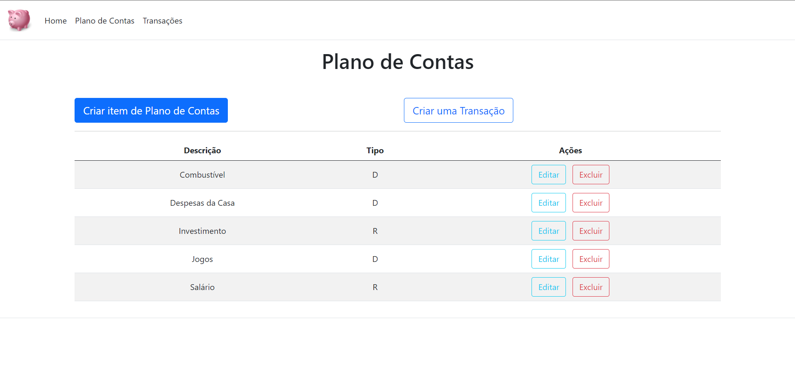
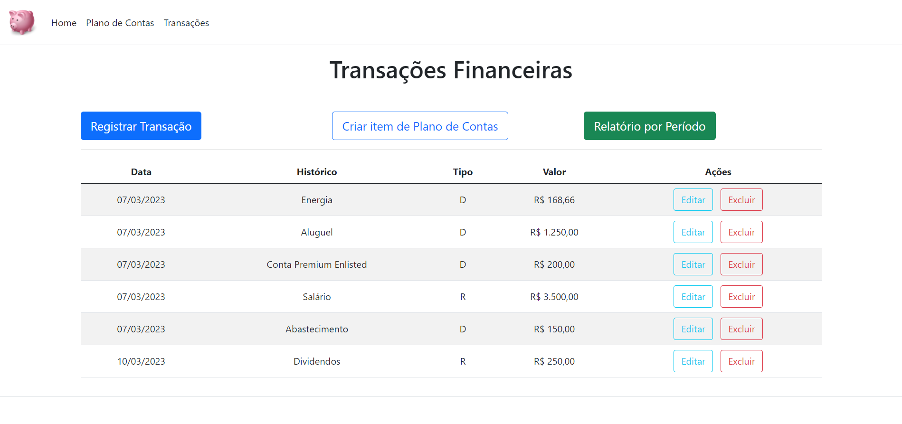
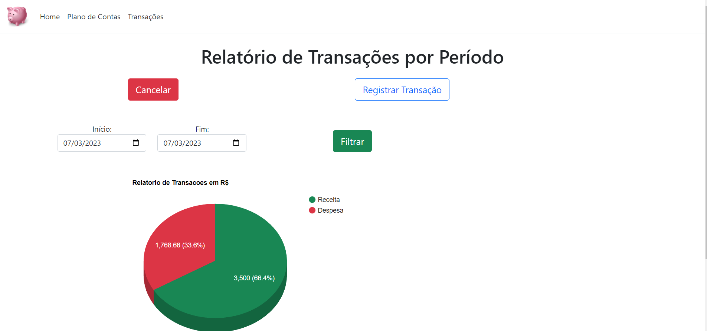

# myfinance-web-netcore
MyFinance - Projeto do Curso de Pós-Graduação em Engenharia da Computação PUC-MG.

Esse é um projeto para controle financeiro pessoa, utilizado para ajudar na medição, rastreabilidade e controle financeiro dos usuários.

É fundamental para garantir a saúde financeira a curto e longo prazo e para alcançar objetivos financeiros, como economizar para uma casa ou uma aposentadoria confortável.

Grupo 7
<ul>
  <li>Carlos César</li>
  <li>Cleuton Correa</li>
  <li>Leonardo de Paula/li>
  <li>Murillo Oliveira</li>
  <li>Sillas Soares</li>
</ul>

O objetivo deste projeto é possibilitar que os usuários registrem suas entradas e saídas financeiras e analisem seus gastos, a fim de que o usuário realize um planejamento financeiro mais eficaz. Essa aplicação permitirá que o usuário crie um Plano de Contas personalizado para categorizar todas as transações, e também fornecerá um relatório detalhado das transações realizadas durante um determinado período.

Tecnologias
-
O projeto manipula as seguintes tecnologias:
<ul>
  <li>ASP .NET MVC</li>
  <li>SQL Server</li>
</ul>

### Requisitos

Para abrir esse projeto, você deve ter instalado a última versão do <a href="https://code.visualstudio.com/" target="_blank">Visual Studio Code</a> e a versão <a href="https://dotnet.microsoft.com/en-us/download/dotnet/thank-you/sdk-6.0.406-windows-x64-installer" target="_blank">6.0</a> do SDK .Net.

O <a href="docs\modelagem\criacao-banco-de-dados.sql" target="_blank"> script</a> de criação do banco de dados deve ser executado para total acesso as funcionalidades da aplicação.

### Diagrama Entidade-Relacionamento - DER
O Banco de Dados da aplicação possuí duas tabelas:
<li> <strong>transacao</strong> - que irá conter os dados das transações financeiras do usuário; </li>
<li> <strong>planoconta</strong> - que irá contecer os itens do Plano de Contas do usuário; </li>
 
 

 
 

# Funcionalidades

## Plano de Contas
No sistema é possível cadastrar Planos de Contas para melhor organização das Transações

## Transações
As Transações são a alma do sistema. Aqui é possível registrar e acompanhar todos os tipos de Transações efetuadas pelo usuário, além de poder registrar Transações futuras.

## Relatórios
Por fim, é possível gerar relatórios de Receita x Despesa, filtrado por período, permitido uma visualização limpa do que entra e do que sai em seu orçamento:

