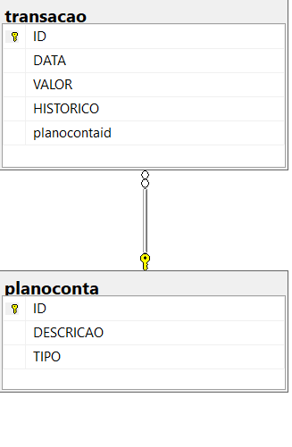

# myfinance-web-netcore
MyFinance - Projeto do Curso de Pós-Graduação em Engenharia da Computação PUC-MG.

Esse é um projeto para controle financeiro pessoa, utilizado para ajudar na medição, rastreabilidade e controle financeiro dos usuários.

É fundamental para garantir a saúde financeira a curto e longo prazo e para alcançar objetivos financeiros, como economizar para uma casa ou uma aposentadoria confortável.

### Requisitos

Para abrir esse projeto, você deve ter instalado a última versão do <a href="https://code.visualstudio.com/" target="_blank">Visual Studio Code</a> e a versão <a href="https://dotnet.microsoft.com/en-us/download/dotnet/thank-you/sdk-6.0.406-windows-x64-installer" target="_blank">6.0</a> do SDK .Net.

O <a href="docs\modelagem\criacao-banco-de-dados.sql" target="_blank"> script</a> de criação do banco de dados deve ser executado para total acesso as funcionalidades da aplicação.

### Diagrama Entidade-Relacionamento - DER
O Banco de Dados da aplicação possuí duas tabelas:
<li> <strong>transacao</strong> - que irá conter os dados das transações financeiras do usuário; </li>
<li> <strong>planoconta</strong> - que irá contecer os itens do Plano de Contas do usuário; </li>
 
 

